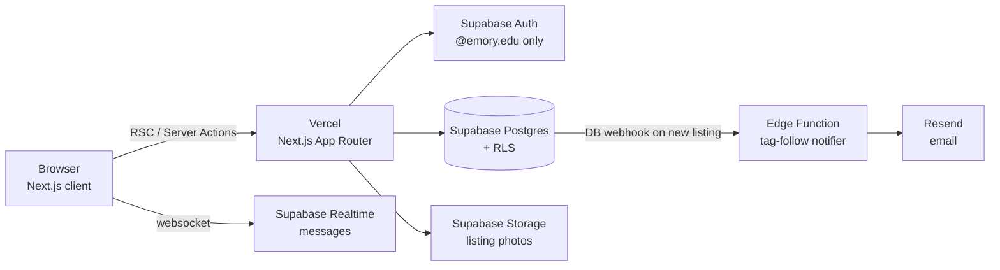

# SwoopSwap: Technical Sprint Plan

**As of:** Sept 23, 2026 · **Team:** Danny Chen, Ruilin Chen, Leah Loukedis, Chloe Peyrebrune (PO), Coralynn Yang (SM), Sihao Zhang
**Jira:** [cs370-ttr-fall-26.atlassian.net](https://cs370-ttr-fall-26.atlassian.net)

We have ten one-week sprints (Sept 28 → Dec 4) before the Dec 9 Showcase. The plan is to get a deployed, Emory-only skeleton up in Sprint 1. The core marketplace (listings, tags, messaging, follow notifications) comes next, and we want a feature-complete MVP by the end of Sprint 6 (Nov 8). That leaves Sprints 7–10 for extension epics and hardening. Scope is the fluid constraint (see the charter), so the extension epics are the first thing we cut when velocity comes in low.

## 1. Constraints that shape the plan

- **Cadence.** Sprints are one calendar week (Mon–Sun). Artifacts and peer feedback are due Tuesday and Thursday of each sprint week. Sprints 3 (Fall Break) and 9 (Thanksgiving) have a single Thursday/Tuesday deadline and get roughly 60% of normal capacity.
- **Grading.** The final project is 40%, split into robustness 10, sophistication 5, UI 5, deployment 5, documentation 5, presentation 5, and sustainability 5. Deployment and documentation are separate line items, so both are part of the Definition of Done from Sprint 1. We don't want to discover them in December.
- **Cost.** We only use free tiers: Vercel Hobby, Supabase Free (500 MB DB, 1 GB storage, 50k MAU), and Resend Free (100 emails/day).
- **Integrity.** Every source file carries the course's "THIS CODE IS OUR OWN WORK…" header with all six names.

## 2. Architecture

| Layer | Choice | Why |
| --- | --- | --- |
| Frontend + server | Next.js 15 (App Router, TypeScript), Tailwind, shadcn/ui | One codebase for UI and server logic. Server Components keep the client JS bundle small. |
| Hosting | Vercel: preview deploy per PR, production from `main` | Every PR gets a URL we can demo in sprint review. |
| Auth | Supabase Auth, email OTP / magic link | No passwords to store. A `before-user-created` auth hook rejects any address not ending in `@emory.edu`, and the signup form checks the same thing up front for UX. |
| Database | Supabase Postgres with Row Level Security | Authorization lives in the DB. A bug in a page can't leak another user's messages. |
| Images | Supabase Storage, resized client-side to ≤1600px WebP before upload | Keeps us under 1 GB and cuts transfer (sustainability). |
| Realtime | Supabase Realtime on `messages` | Chat without running our own socket server. |
| Notifications | Postgres trigger → Edge Function → Resend (email) + `notifications` table (in-app) | Supabase's built-in SMTP caps at a few emails/hour, which is too low for tag alerts. |
| Testing | Vitest (unit), Playwright (2–3 end-to-end happy paths), GitHub Actions CI | Covers the robustness grade. CI blocks merges on red. |

### Data model (v1, extended in later sprints)

| Table | Key columns | Sprint |
| --- | --- | --- |
| `profiles` | `id` (= `auth.users.id`), `display_name`, `grad_year`, `created_at` | 1 |
| `listings` | `id`, `seller_id`, `title`, `description`, `price_cents` (0 = free), `category`, `condition`, `status` (`active`/`pending`/`sold`/`removed`), `available_from`, `available_until`, `created_at` | 1 (schema), 2 (UI) |
| `listing_images` | `listing_id`, `storage_path`, `position` | 2 |
| `tags`, `listing_tags` | `tags.slug` unique; join table | 1 (schema), 3 (UI) |
| `tag_follows` | `user_id`, `tag_id` | 5 |
| `conversations`, `messages` | a conversation is (listing, buyer, seller); messages have `sender_id`, `body`, `read_at` | 4 |
| `notifications` | `user_id`, `type`, `payload jsonb`, `read_at` | 5 |
| `category_weights` | `category`, `est_kg` (reference data for waste diverted) | 6 |
| `ratings` | `rater_id`, `ratee_id`, `listing_id`, `stars`, `comment` | 7 |

RLS in one sentence: anyone signed in can read active listings; only the seller can write their listing; only the two participants can read or write a conversation's messages.

### Sustainability in the design

This is graded, so it has to show up in the design itself, not just in the writeup.
- **Impact metric:** "kg kept out of the landfill." Each sold listing gets a per-category weight estimate (mini-fridge ≈ 20 kg, chair ≈ 7 kg, …; sources cited in the README). We show it on the home page and on each seller's profile.
- **Lightweight by default:** we prefer Server Components and static pages, send images as resized WebP, run no always-on servers, and use scale-to-zero functions. Traffic spikes at move-in/move-out, and nothing runs in between.
- **Social:** free listings are first-class (`price_cents = 0`, with a "Free" filter), so lower-income students aren't priced out.

## 3. Sprint roadmap

Point estimates are team-relative (Fibonacci). There's no velocity yet, so Sprint 1 targets ~25 points. We re-plan each later sprint off the measured velocity.

| Sprint | Dates | Goal | Epics |
| --- | --- | --- | --- |
| 1 | Sep 28 – Oct 4 | Walking skeleton: an Emory student can sign up and land on a deployed app | Foundation, Auth |
| 2 | Oct 5 – Oct 11 | A seller can post a listing with photos; anyone signed in can browse and view it | Listings |
| 3 (short) | Oct 12 – Oct 18 | Listings are tagged, searchable, and filterable (free / category / price) | Tags & Discovery |
| 4 | Oct 19 – Oct 25 | Buyer and seller can message about a listing in real time; seller can mark it pending/sold | Messaging |
| 5 | Oct 26 – Nov 1 | Following a tag sends in-app + email alerts on new matching listings | Notifications |
| 6 | Nov 2 – Nov 8 | **MVP:** waste-diverted metric, profiles, report-listing, RLS audit, E2E tests | Impact, Quality |
| 7 | Nov 9 – Nov 15 | Buyer/seller ratings after a completed sale | Ratings |
| 8 | Nov 16 – Nov 22 | Sublets (Atlanta-area) *or* student services, whichever the PO ranks higher | Sublets / Services |
| 9 (short) | Nov 23 – Nov 29 | Hardening: error states, accessibility pass, empty states, performance budget | Quality |
| 10 | Nov 30 – Dec 6 | Showcase prep: seed data, docs, demo script, final deploy freeze Dec 6 | Release |

If Sprint 2's measured velocity is below ~20 points, Sprint 8 is cut, and Sprint 7 (ratings) becomes the last feature sprint.

## 4. Sprint 1 backlog

Epics are SCRUM-5 (Foundation & DevOps) through SCRUM-14 (Quality & Release), one per roadmap epic.

**Sprint goal:** A student with an `@emory.edu` address can sign up, create a profile, and see the (empty) home page on our production Vercel URL. Every PR runs CI and gets a preview deploy.

| # | Jira | Type | Summary | Pts |
| --- | --- | --- | --- | --- |
| 1 | SCRUM-15 | Task | Repo setup: branch protection on `main`, PR template, CODEOWNERS, integrity header | 1 |
| 2 | SCRUM-16 | Task | Scaffold Next.js + TypeScript + Tailwind + ESLint/Prettier | 2 |
| 3 | SCRUM-17 | Task | Supabase project + local dev via Supabase CLI; `.env.example` | 2 |
| 4 | SCRUM-18 | Task | Link Vercel: preview per PR, production on `main`, env vars set | 2 |
| 5 | SCRUM-19 | Task | GitHub Actions CI: lint, typecheck, Vitest on every PR | 2 |
| 6 | SCRUM-20 | Story | As an Emory student, I can sign up with my @emory.edu email so that only students can use SwoopSwap | 5 |
| 7 | SCRUM-21 | Story | As a new user, I can set my display name and grad year so that other students know who they're dealing with | 3 |
| 8 | SCRUM-22 | Task | DB migration v1: `profiles`, `listings`, `tags`, `listing_tags` with RLS policies | 3 |
| 9 | SCRUM-23 | Story | As a visitor, I see a landing page and nav, and signed-out users are redirected away from app pages | 3 |
| 10 | SCRUM-24 | Task | Write Definition of Done, working agreement, and README setup guide | 1 |
| 11 | SCRUM-25 | Task | Paper prototypes / wireframes for create-listing and browse (input to Sprint 2) | 2 |
| 12 | SCRUM-26 | Spike | Time-boxed (2h): confirm Resend + Supabase email limits and the auth-hook approach | 1 |
| | | | **Total** | **27** |

**Acceptance criteria for the stories:**
- **#6 Emory-only signup:** Given a `@emory.edu` address, I receive a sign-in link/code and am signed in after using it. Given any other domain, signup is rejected with a clear message, both in the form and server-side (the auth hook). A session persists across page refresh, and sign-out works.
- **#7 Profile:** First sign-in routes to a profile form. Display name is required (2–40 chars) and grad year is optional (2026–2031). Users can edit only their own profile (enforced by RLS).
- **#9 App shell:** The landing page explains SwoopSwap in one screen. The nav shows Sign in or the user's name. `/app/*` routes redirect signed-out users to sign-in (via middleware).

## 5. Definition of Done (proposed, adopt at Sprint 1 planning)

A story is done when:
- its acceptance criteria pass
- it has tests for new logic, and CI is green
- one teammate has reviewed and approved the PR
- it is merged to `main` and live on the production URL
- the README/docs are updated if setup or behavior changed
- the Jira ticket is moved to Done with the PR linked.

## 6. Risks and open questions

| Risk | Mitigation |
| --- | --- |
| Supabase built-in SMTP rate limit blocks sign-in emails during the Showcase demo | Configure Resend as custom SMTP in Sprint 1 (spike #12) |
| Empty marketplace at demo time | Seed script with ~40 realistic listings in Sprint 10; recruit friends for real listings in Nov |
| Meetup safety | Suggest public campus pickup spots on the listing; report-listing button in Sprint 6 |
| Six people, one-week sprints, merge conflicts | Small PRs, feature-folder structure, and trunk-based development with short-lived branches |
| Scope creep from sublets/services | These are explicitly the cut line (Sprint 8) |
| A campus marketplace gets built in CS 370 almost every semester, so graders and Showcase visitors may see SwoopSwap as a repeat | Scout past projects in Sprint 1 and build the product and the demo around what they lacked (see below) |

**Standing out from past marketplace teams.** Listings, search, and buyer–seller chat are the baseline that earlier teams have presumably all reached, so on their own they earn us little on sophistication or presentation. The first step is to find out what has actually been done. In Sprint 1, we ask the TAs on Canvas which past teams built a marketplace and look at their proposals, Showcase pages, and demos. We look at their product, never their code, since the integrity header says our code was written without consulting other students' work. The result is a short "what's been done" note in the repo that the PO can use for prioritization and that our pitch can answer directly.

The plan already has features a generic buy/sell board doesn't, and we should treat them as the core of the product rather than as polish. Tag-follow alerts mean a buyer doesn't have to keep checking back, because the listing comes to them. The kg-diverted metric turns the sustainability grade into a number people see on the home page. Free listings are first-class, and signup is limited to verified `@emory.edu` addresses. The Showcase demo should open with these, not save them for the end. The scouting note should also inform the Sprint 8 choice: if past teams did sublets, services is the more distinctive pick, and vice versa. Finally, real usage beats a seeded demo. If the November recruiting push gets actual Emory students listing things, we can report real listings and real kg diverted at the Showcase, which a past team's screenshots can't match.

**Open questions for the PO:**
- Is it sublets or services in Sprint 8? (Weigh this against what past teams built.)
- Do we approach the Office of Sustainability for the weight estimates or a partnership?
- Is the final deliverables date before or after the Dec 9 Showcase? (Confirm on Canvas.)
