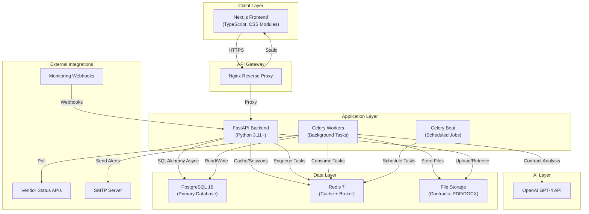
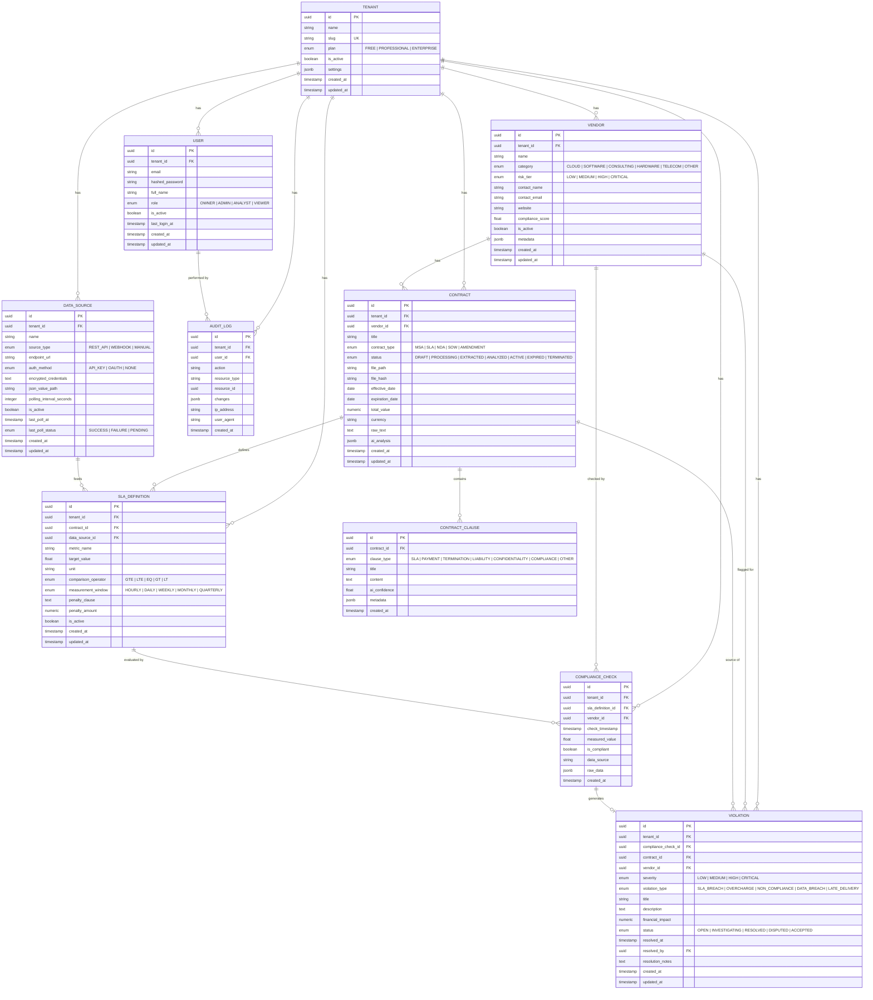

# VendorShield — System Architecture & Master Sprint Backlog

> [!IMPORTANT]
> This document is the single source of truth for the VendorShield platform architecture and all sprint deliverables. Every user story maps directly to a graded sprint artifact submission.

---

## 1. Product Definition

**VendorShield** is a multi-tenant B2B SaaS platform that ingests vendor contracts, extracts SLA terms and compliance obligations using AI (OpenAI GPT-4), monitors live operational data against those obligations, and automatically flags SLA violations, overcharges, and non-compliance events.

**Target Users:** Procurement teams, compliance officers, vendor managers, and finance teams at mid-market and enterprise companies managing 10+ vendor relationships.

**Core Value Proposition:** Companies lose 2–5% of annual vendor spend to SLA violations and billing errors that go undetected. VendorShield automates detection of these losses and provides an auditable trail for dispute resolution.

---

## 2. Tech Stack

| Layer | Technology | Version | Rationale |
|-------|-----------|---------|-----------|
| Frontend Framework | Next.js (App Router) | 14.x | SSR, file-based routing, React Server Components |
| Frontend Language | TypeScript | 5.x | Type safety, refactoring confidence |
| UI Styling | CSS Modules + Custom Properties | — | Zero runtime overhead, scoped styles, design tokens |
| Charting | Recharts | 2.x | React-native charting, composable, SSR-compatible |
| Backend Framework | FastAPI | 0.110+ | Async-native, auto OpenAPI docs, Pydantic v2 integration |
| Backend Language | Python | 3.11+ | AI/ML ecosystem, type hints, async/await |
| ORM | SQLAlchemy (async) | 2.0+ | Industry standard async ORM, Alembic migrations |
| Validation | Pydantic | 2.x | Request/response validation, settings management |
| Database | PostgreSQL | 16 | JSONB, full-text search, row-level security, proven at scale |
| Cache / Message Broker | Redis | 7.x | Session cache, Celery broker, rate limiting |
| Background Jobs | Celery | 5.x | Distributed task queue for AI parsing, compliance checks, reports |
| AI / NLP | OpenAI API (GPT-4) | — | Contract clause extraction, SLA term identification |
| PDF Parsing | pdfplumber | 0.10+ | Reliable multi-column and table-aware PDF text extraction |
| DOCX Parsing | python-docx | 1.x | Microsoft Word document parsing |
| Auth | python-jose (JWT) | 3.x | Stateless JWT access + refresh tokens |
| Password Hashing | passlib + bcrypt | — | Industry-standard password hashing, 12 rounds |
| HTTP Client | httpx | 0.27+ | Async HTTP for external API polling |
| Email | FastAPI-Mail | — | Async email sending for notifications |
| Report Generation | WeasyPrint | 60+ | HTML-to-PDF for compliance reports |
| Containerization | Docker + Docker Compose | — | Reproducible dev and prod environments |
| CI/CD | GitHub Actions | — | Automated testing, linting, Docker builds on push |

---

## 3. System Architecture



---

## 4. Data Model (ERD)



---

## 5. Project Folder Structure

```
vendorshield/
├── backend/
│   ├── app/
│   │   ├── __init__.py
│   │   ├── main.py                  # FastAPI application assembly
│   │   ├── config.py                # Pydantic settings (env-driven)
│   │   ├── database.py              # Async engine, session factory, Base
│   │   ├── models.py                # All SQLAlchemy ORM models
│   │   ├── schemas.py               # All Pydantic request/response schemas
│   │   ├── security.py              # JWT creation/verification, password hashing
│   │   ├── services.py              # Business logic (auth, tenant provisioning)
│   │   ├── middleware.py            # Tenant isolation, audit logging
│   │   └── api/
│   │       ├── __init__.py
│   │       ├── auth.py              # POST /register, /login, /refresh
│   │       ├── health.py            # GET /health, /ready
│   │       ├── tenants.py           # Tenant management (Sprint 1+)
│   │       ├── vendors.py           # Vendor CRUD (Sprint 2+)
│   │       ├── contracts.py         # Contract upload & management (Sprint 2+)
│   │       ├── compliance.py        # SLA checks & monitoring (Sprint 5+)
│   │       ├── violations.py        # Violation management (Sprint 6+)
│   │       ├── reports.py           # Report generation (Sprint 9+)
│   │       ├── datasources.py       # External API config (Sprint 8+)
│   │       └── audit.py             # Audit log viewer (Sprint 9+)
│   ├── tasks/
│   │   ├── __init__.py
│   │   ├── celery_app.py            # Celery configuration
│   │   ├── contract_tasks.py        # Text extraction, AI analysis
│   │   ├── compliance_tasks.py      # Scheduled compliance checks
│   │   ├── notification_tasks.py    # Email alerts
│   │   └── report_tasks.py          # PDF report generation
│   ├── alembic/
│   │   ├── alembic.ini
│   │   ├── env.py
│   │   └── versions/
│   ├── tests/
│   │   ├── conftest.py
│   │   ├── test_auth.py
│   │   ├── test_vendors.py
│   │   ├── test_contracts.py
│   │   └── test_compliance.py
│   ├── requirements.txt
│   └── Dockerfile
├── frontend/
│   ├── src/
│   │   ├── app/
│   │   │   ├── layout.tsx
│   │   │   ├── page.tsx
│   │   │   ├── globals.css
│   │   │   ├── (auth)/
│   │   │   │   ├── login/page.tsx
│   │   │   │   └── register/page.tsx
│   │   │   └── dashboard/
│   │   │       ├── layout.tsx
│   │   │       ├── page.tsx
│   │   │       ├── vendors/page.tsx
│   │   │       ├── contracts/page.tsx
│   │   │       ├── compliance/page.tsx
│   │   │       ├── violations/page.tsx
│   │   │       ├── reports/page.tsx
│   │   │       └── settings/page.tsx
│   │   ├── components/
│   │   │   ├── Sidebar/
│   │   │   ├── Header/
│   │   │   ├── DataTable/
│   │   │   ├── Charts/
│   │   │   ├── FileUpload/
│   │   │   └── ui/
│   │   ├── lib/
│   │   │   ├── api.ts
│   │   │   ├── auth.ts
│   │   │   └── utils.ts
│   │   └── types/
│   │       └── index.ts
│   ├── public/
│   ├── package.json
│   ├── tsconfig.json
│   ├── next.config.mjs
│   └── Dockerfile
├── docs/
│   ├── user-guide.md
│   ├── technical-docs.md
│   ├── api-reference.md
│   └── sustainability-plan.md
├── docker-compose.yml
├── docker-compose.prod.yml
├── .env.example
├── .github/
│   └── workflows/
│       └── ci.yml
├── .gitignore
└── README.md
```

---

## 6. Non-Functional Requirements

| Requirement | Implementation |
|-------------|---------------|
| Multi-tenancy | `tenant_id` column on every business entity; middleware injects tenant scope on every request |
| Data Isolation | All queries filtered by `tenant_id`; cross-tenant access returns 403 |
| Audit Logging | Middleware logs every POST/PUT/PATCH/DELETE with before/after state to `audit_log` table |
| Authentication | JWT access tokens (30 min) + refresh tokens (7 days); bcrypt password hashing (12 rounds) |
| Authorization | Role-based: OWNER > ADMIN > ANALYST > VIEWER; enforced at route level |
| Rate Limiting | Redis-backed rate limiter: 100 req/min per user, 1000 req/min per tenant |
| Input Validation | Pydantic v2 on every request body; file type/size validation on uploads |
| CORS | Locked to frontend origin only (`http://localhost:3000` dev, production domain in prod) |
| Connection Pooling | SQLAlchemy async pool: 20 connections, 10 overflow |
| Background Job Retry | Celery tasks: 3 retries, exponential backoff (30s, 120s, 480s) |
| File Integrity | SHA-256 hash computed on upload, stored with contract record |
| Structured Logging | JSON-formatted logs with correlation IDs for request tracing |
| Health Checks | `GET /health` (liveness) and `GET /ready` (readiness: DB + Redis connectivity) |
| API Documentation | Auto-generated OpenAPI/Swagger at `/docs` |

---

## 7. Master Sprint Backlog

---

### Sprint 1: Foundation & Authentication — Week 6 (Sep 28–30)

**Sprint Goal:** Establish project infrastructure, implement multi-tenant database schema, and deliver a working JWT authentication system with tenant isolation and audit logging.

---

#### US-1.1: Project Scaffolding
**As a** developer, **I need** the project scaffolded with both frontend and backend, Docker Compose, and CI pipeline **so that** the team can begin development immediately.

**Acceptance Criteria:**
- [ ] Backend (FastAPI) starts and serves requests via `docker-compose up`
- [ ] Frontend (Next.js) starts and renders a landing page at `localhost:3000`
- [ ] PostgreSQL 16 and Redis 7 containers start automatically via Docker Compose
- [ ] GitHub Actions CI runs linting (`ruff`) and tests (`pytest`) on every push
- [ ] `.env.example` documents every required environment variable
- [ ] `README.md` contains setup instructions from git clone to running app
- [ ] `.gitignore` covers Python, Node, Docker, and IDE files

**Story Points:** 5

---

#### US-1.2: Multi-Tenant Database Schema
**As a** platform operator, **I need** a multi-tenant database schema **so that** every customer's data is completely isolated at the query level.

**Acceptance Criteria:**
- [ ] `Tenant` model: id (UUID PK), name, slug (unique), plan (enum), settings (JSONB), is_active, timestamps
- [ ] `User` model: id (UUID PK), tenant_id (FK), email (unique per tenant), hashed_password, full_name, role (enum), is_active, timestamps
- [ ] `Vendor` model: id (UUID PK), tenant_id (FK), name, category (enum), risk_tier (enum), compliance_score, is_active, timestamps
- [ ] `Contract` model: id (UUID PK), tenant_id (FK), vendor_id (FK), title, type (enum), status (enum), file_path, file_hash, dates, total_value, raw_text, ai_analysis (JSONB), timestamps
- [ ] `ContractClause` model: id (UUID PK), contract_id (FK), clause_type (enum), title, content, ai_confidence, timestamps
- [ ] `SLADefinition` model: id (UUID PK), tenant_id (FK), contract_id (FK), metric_name, target_value, unit, operator (enum), window (enum), penalty fields, timestamps
- [ ] `ComplianceCheck` model: id (UUID PK), tenant_id (FK), sla_definition_id (FK), measured_value, is_compliant, data_source, timestamps
- [ ] `Violation` model: id (UUID PK), tenant_id (FK), severity (enum), violation_type (enum), financial_impact, status (enum), resolution fields, timestamps
- [ ] `AuditLog` model: id (UUID PK), tenant_id (FK), user_id (FK), action, resource_type, resource_id, changes (JSONB), ip_address, timestamps
- [ ] `DataSource` model: id (UUID PK), tenant_id (FK), name, source_type (enum), endpoint_url, auth_method, polling_interval, timestamps
- [ ] Composite index on `(tenant_id, id)` on every business entity table
- [ ] Alembic initial migration creates all tables

**Story Points:** 8

---

#### US-1.3: User Registration & Login
**As a** new user, **I can** register an account (creating a new tenant) and log in to receive a JWT **so that** I can access the platform securely.

**Acceptance Criteria:**
- [ ] `POST /api/auth/register` accepts `{email, password, full_name, company_name}`
- [ ] Registration creates `Tenant` + `User` (role=OWNER) in a single database transaction
- [ ] Password validated: minimum 8 characters, at least 1 uppercase, 1 lowercase, 1 digit
- [ ] `POST /api/auth/login` accepts `{email, password}`, returns `{access_token, refresh_token, token_type, user}`
- [ ] `POST /api/auth/refresh` accepts `{refresh_token}`, returns new `{access_token}`
- [ ] Passwords hashed with bcrypt (12 rounds)
- [ ] Access token expires in 30 minutes; refresh token expires in 7 days
- [ ] Duplicate email returns 409 Conflict
- [ ] Invalid credentials return 401 Unauthorized
- [ ] All error responses use consistent format: `{detail: string, status_code: int}`

**Story Points:** 8

---

#### US-1.4: Tenant Isolation Middleware
**As a** security requirement, every API request **must be** scoped to the authenticated user's tenant, preventing cross-tenant data access.

**Acceptance Criteria:**
- [ ] Middleware extracts and validates JWT from `Authorization: Bearer <token>` header
- [ ] `tenant_id` and `user_id` extracted from token and injected into `request.state`
- [ ] All protected route handlers access `request.state.tenant_id` for database queries
- [ ] Unauthenticated requests to protected routes return 401
- [ ] Requests with expired tokens return 401 with `"Token expired"` detail
- [ ] Requests with malformed tokens return 401 with `"Invalid token"` detail
- [ ] Health check and auth endpoints are excluded from authentication

**Story Points:** 5

---

#### US-1.5: Audit Logging Middleware
**As a** compliance officer, **I need** every data-modifying action logged **so that** I maintain a complete audit trail.

**Acceptance Criteria:**
- [ ] `AuditLog` record created for every POST, PUT, PATCH, DELETE request
- [ ] Log entry includes: tenant_id, user_id, HTTP method as action, resource_type (from URL path), resource_id (from URL path), IP address, user_agent, timestamp
- [ ] Audit log writes are fire-and-forget (do not block the response)
- [ ] Audit logs are immutable: no UPDATE or DELETE operations permitted on the audit_log table
- [ ] `GET /api/audit-logs` returns paginated, tenant-scoped audit history
- [ ] Audit log endpoint supports filtering by action, resource_type, user_id, and date range

**Story Points:** 5

---

#### US-1.6: Frontend Authentication Shell
**As a** user, **I can** log in and register through a polished web interface **so that** I can access the platform dashboard.

**Acceptance Criteria:**
- [ ] Login page at `/login` with email and password fields, submit button, link to register
- [ ] Register page at `/register` with email, password, full name, company name fields
- [ ] Form validation (client-side) with inline error messages
- [ ] JWT stored in httpOnly cookie or secure localStorage with proper handling
- [ ] Successful login redirects to `/dashboard`
- [ ] Unauthenticated access to `/dashboard/*` redirects to `/login`
- [ ] Dashboard shell page with sidebar navigation placeholder and welcome message
- [ ] Responsive design: functional on desktop (1024px+) and tablet (768px+)

**Story Points:** 8

---

**Sprint 1 Total: 39 story points**

---

### Sprint 2: Contract Ingestion & Vendor Management — Week 7 (Oct 5–7)

**Sprint Goal:** Enable file upload and text extraction from vendor contracts. Build complete vendor CRUD.

---

#### US-2.1: File Upload API
**As a** vendor manager, **I can** upload a contract document (PDF or DOCX) **so that** it is stored securely and associated with a vendor.

**Acceptance Criteria:**
- [ ] `POST /api/contracts/upload` accepts multipart file + JSON metadata (`vendor_id`, `title`, `contract_type`, `effective_date`, `expiration_date`, `total_value`, `currency`)
- [ ] Validates file MIME type: `application/pdf`, `application/vnd.openxmlformats-officedocument.wordprocessingml.document`
- [ ] Validates file size: max 50 MB
- [ ] File stored on disk at `uploads/{tenant_id}/{contract_id}/{filename}`
- [ ] SHA-256 hash computed and stored in `Contract.file_hash`
- [ ] Contract record created with status `DRAFT`
- [ ] Returns contract ID, file metadata, and upload confirmation
- [ ] Triggers Celery task for text extraction

**Story Points:** 5

---

#### US-2.2: Text Extraction Pipeline
**As a** system process, **I extract** raw text from uploaded contracts **so that** the content can be analyzed by AI in subsequent sprints.

**Acceptance Criteria:**
- [ ] Celery task `extract_contract_text` triggered on successful upload
- [ ] PDF text extracted using `pdfplumber` (handles multi-column layouts, tables, headers/footers)
- [ ] DOCX text extracted using `python-docx` (preserves paragraph structure)
- [ ] Extracted text stored in `Contract.raw_text` field
- [ ] Contract status transitions: `DRAFT` → `PROCESSING` → `EXTRACTED`
- [ ] Failed extraction sets status to `EXTRACTION_FAILED` with error details in `ai_analysis` JSONB
- [ ] Retry on transient failures: 3 attempts, exponential backoff

**Story Points:** 5

---

#### US-2.3: Vendor Management CRUD
**As a** vendor manager, **I can** create, view, update, and list vendors **so that** I can organize my vendor relationships.

**Acceptance Criteria:**
- [ ] `POST /api/vendors` creates vendor (name, category, contact_name, contact_email, website)
- [ ] `GET /api/vendors` returns paginated list with search (name), filter (category, risk_tier, is_active), sort (name, compliance_score, created_at)
- [ ] `GET /api/vendors/{id}` returns vendor detail with contract count and latest compliance score
- [ ] `PUT /api/vendors/{id}` updates vendor fields
- [ ] `PATCH /api/vendors/{id}/deactivate` soft-deletes vendor
- [ ] All endpoints enforce tenant isolation
- [ ] Pagination: `?page=1&per_page=20` with total count in response headers

**Story Points:** 5

---

#### US-2.4: Contract Listing & Detail Views
**As a** user, **I can** browse all uploaded contracts and view a specific contract's details **so that** I can manage my contract portfolio.

**Acceptance Criteria:**
- [ ] `GET /api/contracts` returns paginated list filterable by vendor_id, status, contract_type, date range
- [ ] `GET /api/contracts/{id}` returns full contract detail including raw_text preview (first 2000 chars)
- [ ] `GET /api/contracts/{id}/download` returns the original uploaded file
- [ ] `DELETE /api/contracts/{id}` soft-deletes (sets status to TERMINATED)
- [ ] Frontend: contract list page with status badges, vendor name, expiration date
- [ ] Frontend: contract detail page with metadata panel and extracted text viewer

**Story Points:** 5

---

#### US-2.5: Frontend — Contract Upload Flow
**As a** vendor manager, **I can** upload a contract through a drag-and-drop web interface **so that** the process is intuitive and fast.

**Acceptance Criteria:**
- [ ] Upload page at `/dashboard/contracts/upload` with drag-and-drop zone
- [ ] File browser fallback for selecting files
- [ ] Form fields: vendor selector (dropdown), title, contract type (dropdown), effective date, expiration date, total value, currency
- [ ] Client-side file type and size validation before upload
- [ ] Upload progress bar
- [ ] Success notification with link to contract detail page
- [ ] Error notification with specific error message

**Story Points:** 5

---

**Sprint 2 Total: 25 story points**

---

### Sprint 3: AI Contract Analysis — Week 8 (Oct 12–14)

**Sprint Goal:** Integrate OpenAI GPT-4 to automatically extract clauses, SLA terms, and key obligations from contract text.

---

#### US-3.1: AI Clause Extraction
**As a** compliance officer, **I need** the system to automatically identify and categorize clauses in uploaded contracts **so that** I do not have to read every contract manually.

**Acceptance Criteria:**
- [ ] Celery task `analyze_contract` triggered after successful text extraction
- [ ] Sends extracted text to OpenAI GPT-4 with a structured extraction prompt
- [ ] Prompt instructs AI to return JSON array of clauses with: clause_type, title, content, and confidence (0.0–1.0)
- [ ] Prompt includes 3 few-shot examples for each clause type
- [ ] Each extracted clause stored as `ContractClause` record
- [ ] Contract status transitions: `EXTRACTED` → `ANALYZING` → `ANALYZED`
- [ ] Token usage and cost tracked per analysis (stored in `Contract.ai_analysis` JSONB)
- [ ] Retry on API failure: 3 attempts, exponential backoff (30s, 120s, 480s)

**Story Points:** 8

---

#### US-3.2: SLA Term Identification
**As a** vendor manager, **I need** SLA terms automatically extracted from contracts **so that** I can monitor compliance without manual data entry.

**Acceptance Criteria:**
- [ ] AI prompt specifically targets quantifiable SLA terms (e.g., "99.9% uptime", "4-hour response time", "$500 penalty per hour of downtime")
- [ ] Creates `SLADefinition` records with: metric_name, target_value, unit, comparison_operator, measurement_window
- [ ] Extracts penalty clause text and penalty amount when present
- [ ] Links SLA definitions to source contract and source clause
- [ ] SLA definitions created with `is_active=False` (require user confirmation)

**Story Points:** 5

---

#### US-3.3: AI Analysis Review Interface
**As a** user, **I can** review AI-extracted clauses and SLAs, correct errors, and approve the analysis **so that** only verified data enters the compliance engine.

**Acceptance Criteria:**
- [ ] Contract detail page shows "AI Analysis" tab with extracted clauses
- [ ] Each clause displays: type badge, title, content, confidence score (color-coded: green ≥0.9, yellow ≥0.7, red <0.7)
- [ ] Inline editing of clause type, title, and content
- [ ] Delete button to remove false-positive clauses
- [ ] "Add Clause" button for manually adding missed clauses
- [ ] SLA definitions section shows extracted terms with editable fields
- [ ] "Approve & Activate" button sets all SLA definitions to `is_active=True` and contract status to `ACTIVE`

**Story Points:** 8

---

#### US-3.4: Prompt Engineering & Accuracy Baseline
**As a** product requirement, AI extraction **must** achieve ≥85% clause identification accuracy on test contracts.

**Acceptance Criteria:**
- [ ] 10 sample contracts (diverse types: MSA, SLA, NDA, SOW) used as test corpus
- [ ] Extraction prompt optimized with structured JSON output schema
- [ ] Accuracy measured as: (correctly identified clauses) / (total clauses in ground truth)
- [ ] Accuracy results documented per contract type
- [ ] Prompt version stored with each analysis for reproducibility
- [ ] Cost per analysis logged (average tokens, average cost in USD)

**Story Points:** 3

---

**Sprint 3 Total: 24 story points**

---

### Sprint 4: Vendor Profiles & Dashboard Shell — Week 9 (Oct 19–21)

**Sprint Goal:** Build vendor profile pages with compliance context and the main dashboard framework with KPI cards and navigation.

---

#### US-4.1: Vendor Profile Page
**As a** vendor manager, **I can** view a vendor's complete profile **so that** I see all contracts, compliance posture, and activity in one place.

**Acceptance Criteria:**
- [ ] `/dashboard/vendors/{id}` displays: company info, contact details, risk tier badge
- [ ] Contracts tab: list of all contracts for this vendor with status and expiration
- [ ] Compliance tab: compliance score, SLA pass/fail history
- [ ] Violations tab: open and resolved violations for this vendor
- [ ] Activity timeline: recent events (contract uploads, compliance checks, violations)

**Story Points:** 5

---

#### US-4.2: Vendor Risk Tier Calculation
**As a** compliance officer, **I see** vendor risk tiers calculated from compliance history **so that** I can prioritize oversight.

**Acceptance Criteria:**
- [ ] Risk tier auto-calculated: ≥90% compliance → LOW, ≥75% → MEDIUM, ≥50% → HIGH, <50% → CRITICAL
- [ ] Risk tier badge (color-coded) on vendor cards and detail pages
- [ ] Vendor list filterable by risk tier
- [ ] Risk tier recalculated after each new compliance check
- [ ] Risk tier change logged in audit trail

**Story Points:** 3

---

#### US-4.3: Dashboard Home Page
**As a** user, **I see** a dashboard home page with key metrics **so that** I get an instant overview of my compliance posture.

**Acceptance Criteria:**
- [ ] KPI cards: Total Vendors, Active Contracts, Open Violations, Overall Compliance Score
- [ ] Each card shows current value and trend indicator (up/down arrow with % change vs. last month)
- [ ] "Recent Activity" feed: last 10 events across all vendors
- [ ] "Contracts Expiring Soon" widget: contracts expiring within 30 days
- [ ] "Critical Violations" widget: top 5 unresolved CRITICAL/HIGH violations

**Story Points:** 8

---

#### US-4.4: Sidebar Navigation & Layout
**As a** user, **I have** a persistent sidebar navigation **so that** I can access all platform sections from any page.

**Acceptance Criteria:**
- [ ] Sidebar with icons and labels: Dashboard, Vendors, Contracts, Compliance, Violations, Reports, Settings
- [ ] Active route highlighted in sidebar
- [ ] Collapsible sidebar (icon-only mode) for more screen real estate
- [ ] Top header bar with: global search bar, notification bell, user avatar dropdown (Profile, Settings, Logout)
- [ ] Responsive: sidebar collapses to hamburger menu on tablet

**Story Points:** 5

---

#### US-4.5: Global Search
**As a** user, **I can** search across vendors, contracts, and violations from the header search bar **so that** I find what I need fast.

**Acceptance Criteria:**
- [ ] Search bar in header with debounced input (300ms)
- [ ] `GET /api/search?q={query}` searches: vendor names, contract titles, violation titles
- [ ] Results grouped by entity type with max 5 results per group
- [ ] Click result navigates to entity detail page
- [ ] PostgreSQL `tsvector` full-text search on indexed columns

**Story Points:** 5

---

**Sprint 4 Total: 26 story points**

---

### Sprint 5: SLA Monitoring Engine — Week 10 (Oct 26–28)

**Sprint Goal:** Build the compliance check engine that evaluates vendor performance against defined SLA targets.

---

#### US-5.1: SLA Definition Management UI
**As a** compliance officer, **I can** create and manage SLA definitions **so that** I control what is monitored.

**Acceptance Criteria:**
- [ ] `/dashboard/compliance/sla` page lists all active/inactive SLA definitions
- [ ] Create SLA form: select contract, metric name, target value, unit, operator, measurement window, penalty fields
- [ ] Edit and deactivate existing SLA definitions
- [ ] Validation: no duplicate metric_name per contract
- [ ] SLA definition count shown on vendor and contract detail pages

**Story Points:** 5

---

#### US-5.2: Manual Compliance Check
**As a** user, **I can** manually submit a compliance data point **so that** the system evaluates it against the SLA.

**Acceptance Criteria:**
- [ ] `POST /api/compliance/checks` accepts `{sla_definition_id, measured_value, data_source_note}`
- [ ] System compares `measured_value` against SLA `target_value` using `comparison_operator`
- [ ] Creates `ComplianceCheck` record with `is_compliant` flag
- [ ] If non-compliant: automatically creates `Violation` record with auto-assigned severity
- [ ] Vendor `compliance_score` recalculated immediately
- [ ] Frontend form on compliance page for manual entry

**Story Points:** 5

---

#### US-5.3: Compliance Check Scheduling
**As a** system, **I run** compliance checks automatically on a configured schedule **so that** violations are detected without manual intervention.

**Acceptance Criteria:**
- [ ] Celery Beat task `run_scheduled_checks` fires every 15 minutes
- [ ] Task queries all active SLA definitions with a connected data source whose measurement_window has elapsed
- [ ] For each, pulls latest value from data source and runs compliance evaluation
- [ ] Results stored as `ComplianceCheck` records
- [ ] Failed data pulls (timeout, error) logged but not counted as violations
- [ ] Next scheduled check time displayed on SLA definition detail

**Story Points:** 8

---

#### US-5.4: Compliance Score Engine
**As a** vendor manager, **I see** real-time compliance scores **so that** I can track vendor performance at a glance.

**Acceptance Criteria:**
- [ ] Compliance score = (compliant checks / total checks) × 100, rolling 90-day window
- [ ] Calculated per SLA definition, per vendor, and per tenant
- [ ] Score updates triggered after every new `ComplianceCheck`
- [ ] Vendor list sortable by compliance score
- [ ] Score badge color: ≥90% green, ≥75% yellow, ≥50% orange, <50% red

**Story Points:** 3

---

**Sprint 5 Total: 21 story points**

---

### Sprint 6: Violation Detection & Notifications — Week 11 (Nov 2–4)

**Sprint Goal:** Implement automated violation classification, financial impact calculation, and email notification system.

---

#### US-6.1: Violation Auto-Classification
**As a** system, **I automatically** classify violations by severity and type **so that** users can prioritize response.

**Acceptance Criteria:**
- [ ] Severity auto-assigned: <5% deviation → LOW, <15% → MEDIUM, <30% → HIGH, ≥30% → CRITICAL
- [ ] `violation_type` inferred: uptime/availability metrics → SLA_BREACH, billing metrics → OVERCHARGE, regulatory metrics → NON_COMPLIANCE
- [ ] Duplicate suppression: no new violation if identical open violation exists for same SLA definition
- [ ] Violation title auto-generated: "[SEVERITY] [metric_name] violation for [vendor_name]"

**Story Points:** 3

---

#### US-6.2: Financial Impact Calculator
**As a** finance team member, **I see** the financial impact of each violation **so that** I can quantify revenue leakage.

**Acceptance Criteria:**
- [ ] Financial impact = `SLADefinition.penalty_amount × deviation_magnitude` (capped at contract total_value)
- [ ] Cumulative financial impact per vendor, per contract, per tenant
- [ ] Dashboard card: "Revenue at Risk" with total across all open violations
- [ ] `GET /api/violations/financial-summary` returns breakdown by vendor and by violation_type
- [ ] Financial amounts formatted with currency symbol

**Story Points:** 5

---

#### US-6.3: Email Alert System
**As a** user, **I receive** email alerts when violations are detected **so that** I can act immediately.

**Acceptance Criteria:**
- [ ] Celery task `send_violation_alert` triggered on violation creation
- [ ] Email template contains: violation title, severity badge, vendor name, contract reference, measured vs. target values, financial impact, link to violation detail page
- [ ] User notification preferences: configurable severity threshold (default: HIGH+)
- [ ] Notification frequency options: IMMEDIATE, DAILY_DIGEST
- [ ] Daily digest sent at 8:00 AM tenant timezone via Celery Beat
- [ ] Email sending via FastAPI-Mail with SMTP configuration

**Story Points:** 8

---

#### US-6.4: Violation Management Workflow
**As a** compliance officer, **I can** triage violations through a defined workflow **so that** every violation is tracked to resolution.

**Acceptance Criteria:**
- [ ] Status transitions: OPEN → INVESTIGATING → RESOLVED | DISPUTED | ACCEPTED
- [ ] Status change requires: next_status, notes (required for RESOLVED and DISPUTED)
- [ ] RESOLVED requires `resolved_by` (auto-set to current user) and `resolution_notes`
- [ ] DISPUTED allows file upload for supporting evidence
- [ ] Violation detail page shows: full context (SLA definition, measured vs. target, contract clause text), status timeline, attached files
- [ ] Violation list page with filters: status, severity, vendor, violation_type, date range

**Story Points:** 8

---

**Sprint 6 Total: 24 story points**

---

### Sprint 7: Dashboard & Analytics — Week 12 (Nov 9–11)

**Sprint Goal:** Build comprehensive analytics with interactive charts, trends, and drill-down views.

---

#### US-7.1: Executive Dashboard
**As a** C-level executive, **I see** a high-level dashboard **so that** I grasp our compliance posture in 10 seconds.

**Acceptance Criteria:**
- [ ] KPI cards with sparkline trends: Compliance Score, Active Violations, Revenue at Risk, Vendor Count
- [ ] Compliance trend line chart: last 12 months, score plotted monthly
- [ ] Vendor risk heatmap: table with vendors as rows, SLA categories as columns, cells color-coded by compliance
- [ ] All data real-time, tenant-scoped

**Story Points:** 8

---

#### US-7.2: Vendor Comparison Charts
**As a** vendor manager, **I can** compare vendors visually **so that** I identify underperformers instantly.

**Acceptance Criteria:**
- [ ] Horizontal bar chart: compliance score per vendor (sorted descending)
- [ ] Radar chart: multi-dimensional compliance per selected vendor (uptime, response time, quality, billing accuracy)
- [ ] Chart filters: date range picker, vendor multi-select, SLA category
- [ ] Charts rendered with Recharts, responsive, animated on data load

**Story Points:** 5

---

#### US-7.3: Violation Analytics
**As a** compliance officer, **I see** violation trends **so that** I detect systemic issues.

**Acceptance Criteria:**
- [ ] Stacked area chart: violation count over time grouped by severity
- [ ] Donut chart: violation distribution by type (SLA_BREACH, OVERCHARGE, etc.)
- [ ] Bar chart: average resolution time (days) grouped by severity
- [ ] "Repeat Offenders" table: top 5 vendors by violation count in selected period
- [ ] All charts filter-aware: respond to global date range selector

**Story Points:** 5

---

#### US-7.4: Contract Expiration Tracker
**As a** vendor manager, **I see** upcoming contract expirations **so that** I renew or renegotiate on time.

**Acceptance Criteria:**
- [ ] Dashboard widget: contracts expiring in 30/60/90 days with countdown
- [ ] Timeline/calendar view of expirations
- [ ] Celery Beat task sends email alert at 90, 60, and 30 days before expiration
- [ ] Expired contracts auto-set to status `EXPIRED` via nightly Celery task

**Story Points:** 5

---

**Sprint 7 Total: 23 story points**

---

### Sprint 8: External API Integration & Live Monitoring — Week 13 (Nov 16–18)

**Sprint Goal:** Build connectors for external data sources to feed real-time data into the compliance engine.

---

#### US-8.1: Data Source Configuration
**As an** admin, **I can** configure external API data sources **so that** compliance checks pull live data.

**Acceptance Criteria:**
- [ ] `POST /api/datasources` creates config: name, source_type (REST_API, WEBHOOK, MANUAL), endpoint_url, auth_method (API_KEY, OAUTH, NONE), json_value_path, polling_interval_seconds
- [ ] "Test Connection" endpoint validates config by making a test request
- [ ] API keys and OAuth credentials encrypted at rest (Fernet symmetric encryption)
- [ ] Data source linkable to one or more SLA definitions
- [ ] Frontend settings page for data source CRUD

**Story Points:** 8

---

#### US-8.2: API Polling Engine
**As a** system, **I poll** configured REST APIs on schedule and feed data into compliance checks **so that** monitoring is continuous.

**Acceptance Criteria:**
- [ ] Celery Beat dispatches per-source polling tasks based on `polling_interval_seconds`
- [ ] Task makes HTTP GET to `endpoint_url` with configured auth headers
- [ ] Response parsed using `json_value_path` (JSONPath expression to extract numeric value)
- [ ] Extracted value submitted to compliance check engine for each linked SLA definition
- [ ] `last_poll_at` and `last_poll_status` updated on `DataSource` record
- [ ] Retry on failure: 3 attempts, exponential backoff
- [ ] Timeout: 30 seconds per request

**Story Points:** 8

---

#### US-8.3: Webhook Receiver
**As a** system, **I accept** incoming webhooks from monitoring tools **so that** external systems can push data to VendorShield.

**Acceptance Criteria:**
- [ ] `POST /api/webhooks/{source_id}` accepts arbitrary JSON payload
- [ ] Webhook token verification: `X-Webhook-Secret` header matched against stored secret
- [ ] Payload parsed using `json_value_path` from linked `DataSource` config
- [ ] Extracted value processed through compliance check engine
- [ ] Webhook receipt logged in audit trail
- [ ] Unverified webhooks rejected with 403

**Story Points:** 5

---

#### US-8.4: Invoice Overcharge Detection
**As a** finance team member, **I can** upload invoice data and detect overcharges **so that** billing errors are caught.

**Acceptance Criteria:**
- [ ] `POST /api/invoices/check` accepts CSV upload with columns: vendor_name, service_description, quantity, invoiced_amount, billing_period
- [ ] System matches invoice line items to contracted rates (from contract `ai_analysis` JSONB)
- [ ] Overcharge = invoiced_amount − contracted_rate × quantity (if positive)
- [ ] Each overcharge creates `Violation` with type `OVERCHARGE` and `financial_impact` set
- [ ] Summary response: total overcharges, breakdown by vendor, breakdown by line item

**Story Points:** 8

---

**Sprint 8 Total: 29 story points**

---

### Sprint 9: Reporting & Full Audit Trail — Week 14 (Nov 23)

**Sprint Goal:** Build PDF report generation, comprehensive audit trail viewer, and data export across all entities.

---

#### US-9.1: PDF Report Generation
**As a** compliance officer, **I can** generate PDF reports **so that** I share compliance status with stakeholders who do not use the platform.

**Acceptance Criteria:**
- [ ] Report types: Vendor Compliance Summary, Contract Audit Report, Violation Summary, Financial Impact Report
- [ ] `POST /api/reports/generate` accepts `{report_type, filters (vendor_id, date_range, etc.)}`
- [ ] Celery task generates PDF using WeasyPrint (HTML template → PDF)
- [ ] PDF includes: header with logo, generated timestamp, summary metrics, data tables, charts (rendered as static images)
- [ ] Generated report stored in `uploads/{tenant_id}/reports/{report_id}.pdf`
- [ ] Report history page: list of generated reports with download links
- [ ] Report scheduling: configure weekly or monthly auto-generation via Celery Beat

**Story Points:** 8

---

#### US-9.2: Audit Trail Viewer
**As an** admin, **I can** view and search the complete audit trail **so that** I prove compliance during audits.

**Acceptance Criteria:**
- [ ] `/dashboard/audit` page with paginated table: timestamp, user, action, resource type, resource, IP address
- [ ] Filters: user (dropdown), action (POST/PUT/PATCH/DELETE), resource_type, date range
- [ ] Expandable row shows `changes` JSONB with before/after diff view
- [ ] Sort by timestamp (default: newest first)
- [ ] Export to CSV button
- [ ] Retention policy: configurable, default 7 years

**Story Points:** 5

---

#### US-9.3: Universal Data Export
**As a** user, **I can** export any data view to CSV **so that** I analyze data in Excel or import to other systems.

**Acceptance Criteria:**
- [ ] Export button on every list page: vendors, contracts, violations, compliance checks, SLA definitions
- [ ] `GET /api/{entity}/export?format=csv` with same filters as list endpoint
- [ ] Exports respect current filter selections
- [ ] Exports with >1000 rows handled async: Celery task generates file, download link emailed to user
- [ ] CSV encoding: UTF-8 with BOM for Excel compatibility

**Story Points:** 5

---

#### US-9.4: Shareable Executive Summary
**As a** C-level executive, **I can** share a read-only compliance summary via link **so that** board members can view it without an account.

**Acceptance Criteria:**
- [ ] "Share" button on executive dashboard generates a unique, time-limited URL (expires in 7 days)
- [ ] Shared page is read-only, no navigation, no auth required
- [ ] Contains: compliance score, top risks, financial impact, key recommendations
- [ ] Shared link can be revoked by admin
- [ ] PDF download button on shared page

**Story Points:** 5

---

**Sprint 9 Total: 23 story points**

---

### Sprint 10: Polish, Deploy, Document — Week 15 (Nov 30–Dec 2)

**Sprint Goal:** Final hardening, production deployment, user and technical documentation, sustainability plan, and presentation preparation.

---

#### US-10.1: Production Deployment
**As a** system operator, **I can** deploy VendorShield to a production environment **so that** it is publicly accessible.

**Acceptance Criteria:**
- [ ] `docker-compose.prod.yml` with production configs (no debug, production secrets)
- [ ] All environment variables documented in `.env.example`
- [ ] Alembic migrations run automatically on container start
- [ ] Health check endpoints (`/health`, `/ready`) return 200 when all services are operational
- [ ] Application accessible via public URL (university server, Railway, Render, or AWS)
- [ ] HTTPS enabled
- [ ] Database backup script included

**Story Points:** 8

---

#### US-10.2: User Documentation
**As a** new user, **I can** read documentation explaining every feature **so that** I use the platform without training.

**Acceptance Criteria:**
- [ ] Getting Started: registration, first login, dashboard orientation
- [ ] Uploading Contracts: step-by-step with screenshots
- [ ] Managing Vendors: creating, editing, viewing profiles
- [ ] Understanding the Dashboard: KPI cards, charts, widgets explained
- [ ] Compliance Monitoring: SLA definitions, manual checks, automated checks
- [ ] Violation Management: triage workflow, resolution, disputes
- [ ] Reports: generating, scheduling, sharing
- [ ] Settings: notification preferences, data sources, team management
- [ ] FAQ: 10+ common questions with answers
- [ ] Hosted at `/docs` or as a separate page within the app

**Story Points:** 8

---

#### US-10.3: Technical Documentation
**As a** developer, **I can** read technical docs **so that** I set up, maintain, and extend the platform.

**Acceptance Criteria:**
- [ ] Architecture overview with system diagram
- [ ] API reference (auto-generated Swagger + endpoint descriptions)
- [ ] Database schema documentation with ERD and field descriptions
- [ ] Development setup guide: from `git clone` to running all services
- [ ] Testing guide: how to run tests, add tests, test coverage report
- [ ] Deployment guide: environment setup, Docker commands, monitoring
- [ ] Code style guide: linting rules, naming conventions, PR process

**Story Points:** 5

---

#### US-10.4: Sustainability Plan
**As a** course requirement, **the project** includes a sustainability plan **so that** it can be maintained after the semester.

**Acceptance Criteria:**
- [ ] Dependency management: all versions pinned, Dependabot or Renovate config
- [ ] Upgrade path: documented process for upgrading Python, Node, PostgreSQL, and all dependencies
- [ ] Monitoring: health check endpoints, structured logging, error tracking recommendations (Sentry)
- [ ] Backup strategy: database backup schedule, file storage backup
- [ ] Knowledge transfer: README, architecture docs, code comments, decision log
- [ ] CI/CD pipeline: tests, linting, and Docker build run on every push
- [ ] License: MIT license applied to repository

**Story Points:** 3

---

#### US-10.5: Project Showcase Presentation
**As a** team, **we deliver** a polished presentation **so that** we demonstrate the platform compellingly.

**Acceptance Criteria:**
- [ ] Slide deck: 12–15 slides covering problem, solution, demo, architecture, contributions, lessons learned
- [ ] Live demo script: rehearsed 3+ times, covers 5 key workflows (upload → analyze → monitor → detect → report)
- [ ] Backup: pre-recorded demo video in case of live failure
- [ ] Every team member presents at least one section
- [ ] Q&A prep: 10 anticipated questions with prepared answers

**Story Points:** 5

---

**Sprint 10 Total: 29 story points**

---

## 8. Sprint Velocity Summary

| Sprint | Theme | Story Points |
|--------|-------|-------------|
| 1 | Foundation & Authentication | 39 |
| 2 | Contract Ingestion & Vendor Management | 25 |
| 3 | AI Contract Analysis | 24 |
| 4 | Vendor Profiles & Dashboard Shell | 26 |
| 5 | SLA Monitoring Engine | 21 |
| 6 | Violation Detection & Notifications | 24 |
| 7 | Dashboard & Analytics | 23 |
| 8 | External API Integration | 29 |
| 9 | Reporting & Audit Trail | 23 |
| 10 | Polish, Deploy, Document | 29 |
| **Total** | | **263** |

**Average velocity target: 26 points/sprint with a 5–6 person team.**

---

## 9. Project Proposal Mapping

This architecture and backlog directly feeds the **Project Proposal** deliverable (due Week 4, Friday Sep 18, worth 5%). The proposal document and presentation should include:

1. **Problem Statement:** 2–5% vendor spend leakage from unmonitored SLAs and billing errors
2. **Proposed Solution:** VendorShield — AI-driven compliance automation
3. **Target Users:** Procurement, compliance, finance teams
4. **Key Features:** Contract AI analysis, SLA monitoring, violation detection, financial impact reporting
5. **Technology Stack:** (Section 2 of this document)
6. **Architecture:** (Section 3 of this document)
7. **Sprint Plan:** (Section 7 of this document, summarized)
8. **Team Roles:** Map team members to Scrum roles + technical areas
9. **Risks & Mitigations:** AI accuracy uncertainty (mitigation: human review), scope creep (mitigation: strict sprint goals)
